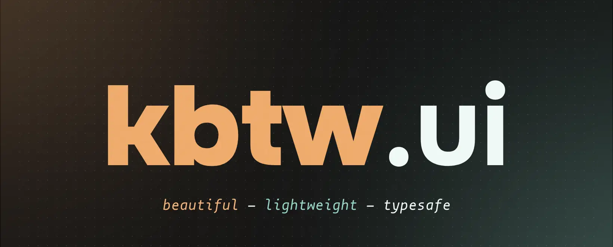

<span style="width: 100%; display: flex; align-items: center; justify-content: center;">
  
</span>

---

**kbtw.ui** is a lightweight React UI library made for personal & small scale projects - batteries included.

### Magnificent in simplicity

Heavily inspired by [Joy UI](https://mui.com/joy-ui/getting-started/) and [Google's Material You](https://m3.material.io/), it's perfect for building slick and modern web applications.

### Typesafe

Built with Typescript in mind, it integrates seamlessly in React+TS projects.

### Batteries included

kbtw.ui does not use any kind of supplemental styling libraries, and comes with everything you need straight out of the box, making it a perfect fit for tiny projects, where size matters.

## Usage

The library is not yet published to npm, so you'll need to build and link it yourself.

```sh
git clone https://github.com/katsukibtw/kbtw.ui && cd kbtw.ui
pnpm i
pnpm build
pnpm link --global
```
